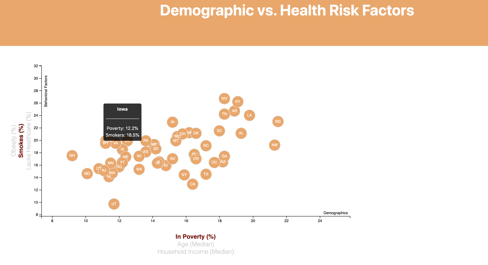
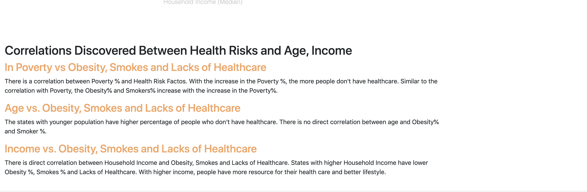

# Unit 16 | Assignment - Data Journalism and D3

## Background

This project is to assess the health risks facing particular demographics. Data from the U.S. Census Bureau and the Behavioral Risk Factor Surveillance System was used for the analysis.

The data set is based on 2014 ACS 1-year estimates: [https://factfinder.census.gov/faces/nav/jsf/pages/searchresults.xhtml](https://factfinder.census.gov/faces/nav/jsf/pages/searchresults.xhtml). The current data set incldes data on rates of income, obesity, poverty, etc. by state. MOE stands for "margin of error."

D3 techniques was used to generate a scatter plot that represents each state with circle elements. This scatter plot include multiple demographics (In Poverty, Income and Age) and multiple risk factors (Lacks of Healthcare, Obesity and Smokes). 

To understand the correlation between each demographic and risk factor, click on the x-label and y-label. To get information for each state, click on the circle element, information will be shown in the tooltip element.

